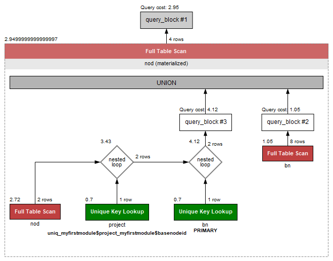
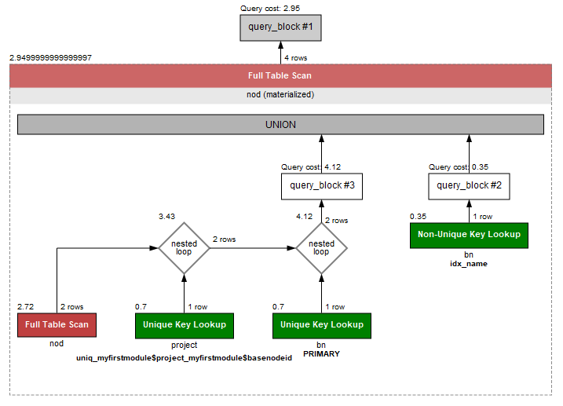

# 重命名

[参考](https://github.com/engalar/mendix-custom-widget-radar/commit/07fd0dfb69b781c0b31cdb5502678304c954383c)

# 试用

```
git clone https://gitee.com/engalar/mendix-custom-widget-gantt.git --depth=1 ./dummy && cd ./dummy && git clone https://gitee.com/engalar/mendix-testproject-800.git --depth=1 ./tests/testProject && rd /s /q  .\tests\testProject\.git && xcopy dummy .\tests\testProject /E /Y && start tests/testProject/testProject.mpr
```

# 开发

```
git clone --recurse-submodules https://gitee.com/engalar/mendix-custom-widget-gantt.git.&& npm run m && npm run x && npm run testProject && npm run start
```

# demo 数据
```
P1/P2/P3/T1
P4/T2
P4/P5/T3
```
# 查询示例
## 示例1
查询叶子节点 `P1/P2/P3/T1` 到根节点路径上的所有节点
```sql

WITH recursive nod as (
  select
    bn.*
  from
    `myfirstmodule$basenode` bn
  where
    bn.name = 'P1/P2/P3/T1'
  union
  all
  select
    bn.*
  from
    `myfirstmodule$basenode` bn
    inner join `myfirstmodule$project` project on project.`myfirstmodule$projectnodeid` = bn.id
    inner join nod on project.`myfirstmodule$basenodeid` = nod.id
  where
    nod.id = project.`myfirstmodule$basenodeid`
)
select
  *
from
  nod;

```
```csv
12103423998558209	P1/P2/P3/T1			0.00000000	MyFirstModule.TaskNode
12666373951979523	P1/P2/P3			0.00000000	MyFirstModule.ProjectNode
12666373951979522	P1/P2			0.00000000	MyFirstModule.ProjectNode
12666373951979521	P1			0.00000000	MyFirstModule.ProjectNode
```

## 示例2
查询叶子节点 `P4/T2` 到根节点路径上的所有节点 的所有直接子节点
```sql
WITH recursive nod as (
  select
    bn.*
  from
    `myfirstmodule$basenode` bn
  where
    bn.name = 'P4/T2'
  union
  all
  select
    bn.*
  from
    `myfirstmodule$basenode` bn
    inner join `myfirstmodule$project` project on project.`myfirstmodule$projectnodeid` = bn.id
    inner join nod on project.`myfirstmodule$basenodeid` = nod.id
  where
    nod.id = project.`myfirstmodule$basenodeid`
)
select
  bn.*
from
  `myfirstmodule$basenode` bn
  inner join `myfirstmodule$project` project on project.`myfirstmodule$basenodeid` = bn.id
  inner join nod on project.`myfirstmodule$projectnodeid` = nod.id;
```
```
12103423998558210	P4/T2			0.00000000	MyFirstModule.TaskNode
12666373951979525	P4/P5			0.00000000	MyFirstModule.ProjectNode
```

# 优化示例2
- 优化前


- 优化

```sql
ALTER TABLE `mendix`.`myfirstmodule$basenode` 
ADD INDEX `idx_name` (`name` ASC, `id` ASC) VISIBLE;
;
```
- 优化后

